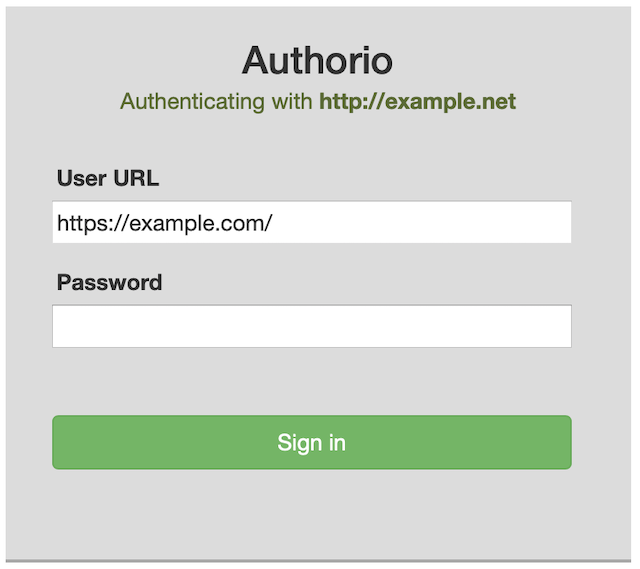

# Authorio
The Authorio plugin turns any Rails-based site into an authentication endpoint for Indieauth.

## Motivation
[IndieAuth](https://indieauth.com/faq) is an authentication protocol that allows you to sign in to a website using a domain name (assuming the web site supports IndieAuth). There are two servers involved in the transaction: the *client*, which is where you're logging in to (authenticating with), and the *authentication endpoint*, which verifies you are who you say you are.

There are several implementations for IndieAuth clients, if you want to support IndieAuth login on your site. But there aren't many useful implementations of the authentication endpoint. Many people work around this by using an IndieAuth service, such as [RelMeAuth](https://indieweb.org/RelMeAuth) which delegates authentication to a third-party site such as Twitter or Facebook.

Authorio allows you to create a truly federated authentication setup, using your own Rails site. By adding Authorio to your site, you can remove any external authentication dependencies and log in using only servies you control.

## Installation

### Add the Authorio Gem to your bundle
Add this line to your application's Gemfile:

```ruby
gem 'authorio'
```

And then execute:
```bash
$ bundle
```

### Install Authorio config files
```bash
$ rails generate authorio:install
```

### Install Authorio migrations
Authorio needs to add a couple tables to your app's database in order to store (hashed) passwords and access tokens.
You will need to install the migrations and then run them to add these tables
```bash
$ rails authorio:install:migrations
Copied migration 20210703002653_create_authorio_users.authorio.rb from authorio
Copied migration 20210703002654_create_authorio_requests.authorio.rb from authorio
$ rails db:migrate
...
== 20210703002653 CreateAuthorioUsers: migrated (0.0038s) =====================
...
== 20210703002654 CreateAuthorioRequests: migrated (0.0041s) ==================
```

### Install Authorio routes
Add the following line somewhere inside the `Rails.application.routes.draw do` block in your `config/routes.rb` file
```ruby
authorio_routes
```

### Add the Indieauth tags
Somewhere on your home page, add the following to your view template:
```erb
<%= indieauth_tag %>
```

This part of the protocol will tell the IndieAuth client where to redirect for authentication. Note that ideally
you should only place this tag on your home page, and not in a layout that will put it on every page on your site.
(It won't hurt anything but it's redundant to have it in multiple locations)

### Set your initial password
By default, Authorio uses a simple password to authenticate you. This password is hashed and stored in your app
database, which presumably you control.

You are free to customize Authorio to change its authentication scheme however you want, but to get started
quickly you'll want to set up a password for yourself.

```bash
$ rake authorio:password

Enter new password: 
Confirm password: 
Password set
```

Now restart your rails app, and you should be all set!

## Usage

To test your authentication endpoint, find an IndieAuth client you can log in to. A simple test is at [IndieWebify.Me](indiewebify.me). Enter your site's URL in the Web Sign In and click Test.

You should be then be redirected back to your own site and the Authorio
login UI  


Enter the password you set up when you installed Authorio. This should redirect you back to the client where you
will be logged in!

## Contributing
Send pull requests to [Authorio on GitHub](https://github.com/reiterate-app/authorio)

## License
The gem is available as open source under the terms of the [MIT License](https://opensource.org/licenses/MIT).
